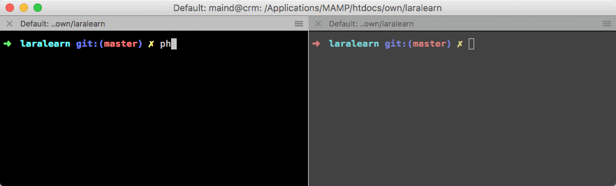

# Laravel Console Mutex

[](https://www.patreon.com/illuminated)

[](https://styleci.io/repos/59570052)
[](https://travis-ci.org/dmitry-ivanov/laravel-console-mutex)
[](https://coveralls.io/github/dmitry-ivanov/laravel-console-mutex?branch=5.7)

[](https://packagist.org/packages/illuminated/console-mutex)
[](https://packagist.org/packages/illuminated/console-mutex)
[](https://packagist.org/packages/illuminated/console-mutex)
[](https://packagist.org/packages/illuminated/console-mutex)

Mutex for Laravel console commands.

| Laravel | Console Mutex                                                            |
| ------- | :----------------------------------------------------------------------: |
| 5.1.*   | [5.1.*](https://github.com/dmitry-ivanov/laravel-console-mutex/tree/5.1) |
| 5.2.*   | [5.2.*](https://github.com/dmitry-ivanov/laravel-console-mutex/tree/5.2) |
| 5.3.*   | [5.3.*](https://github.com/dmitry-ivanov/laravel-console-mutex/tree/5.3) |
| 5.4.*   | [5.4.*](https://github.com/dmitry-ivanov/laravel-console-mutex/tree/5.4) |
| 5.5.*   | [5.5.*](https://github.com/dmitry-ivanov/laravel-console-mutex/tree/5.5) |
| 5.6.*   | [5.6.*](https://github.com/dmitry-ivanov/laravel-console-mutex/tree/5.6) |
| 5.7.*   | [5.7.*](https://github.com/dmitry-ivanov/laravel-console-mutex/tree/5.7) |



## Table of contents

- [Usage](#usage)
- [Strategies](#strategies)
- [Advanced](#advanced)
  - [Set custom timeout](#set-custom-timeout)
  - [Handle several commands](#handle-several-commands)
  - [Custom mutex file storage](#custom-mutex-file-storage)
- [Troubleshooting](#troubleshooting)
  - [Trait included, but nothing happens?](#trait-included-but-nothing-happens)
  - [Several traits conflict?](#several-traits-conflict)
- [License](#license)

## Usage

1. Install package through `composer`:

    ```shell
    composer require "illuminated/console-mutex:5.7.*"
    ```

2. Use `Illuminated\Console\WithoutOverlapping` trait:

    ```php
    use Illuminated\Console\WithoutOverlapping;

    class ExampleCommand extends Command
    {
        use WithoutOverlapping;

        // ...
    }
    ```

## Strategies

Overlapping can be prevented by various strategies:

- `file` (default)
- `mysql`
- `redis`
- `memcached`

Default `file` strategy is fine for small applications, which are deployed on a single server.
If your application is more complex and deployed on several nodes, then you probably would like to use another mutex strategy.

You can change the mutex strategy by specifying `$mutexStrategy` field:

```php
class ExampleCommand extends Command
{
    use WithoutOverlapping;

    protected $mutexStrategy = 'mysql';

    // ...
}
```

Or by using `setMutexStrategy` method:

```php
class ExampleCommand extends Command
{
    use WithoutOverlapping;

    public function __construct()
    {
        parent::__construct();

        $this->setMutexStrategy('mysql');
    }

    // ...
}
```

## Advanced

### Set custom timeout

By default, the mutex is checking for a running command, and if it finds such, it just exits. However, you can manually
set the timeout for a mutex, so it can wait for another command to finish its execution, instead of just quitting immediately.

You can change the mutex timeout by specifying `$mutexTimeout` field:

```php
class ExampleCommand extends Command
{
    use WithoutOverlapping;

    protected $mutexTimeout = 3000; // milliseconds

    // ...
}
```

Or by using `setMutexTimeout` method:

```php
class ExampleCommand extends Command
{
    use WithoutOverlapping;

    public function __construct()
    {
        parent::__construct();

        $this->setMutexTimeout(3000); // milliseconds
    }

    // ...
}
```

There are three possible options for `$mutexTimeout` field:

- `0` - check without waiting (default);
- `{milliseconds}` - check, and wait for a maximum of milliseconds specified;
- `null` - wait, till running command finish its execution;

### Handle several commands

Sometimes it is useful to set common mutex for several commands. You can easily achieve this by setting them the same mutex name.
By default, mutex name is generated based on a command's name and arguments.

To change this, override `getMutexName` method in your command:

```php
class ExampleCommand extends Command
{
    use WithoutOverlapping;

    public function getMutexName()
    {
        return "icmutex-for-command1-and-command2";
    }

    // ...
}
```

### Custom mutex file storage

If you're using `file` strategy, mutex files will be stored in the `storage/app` folder, by default.

You can change the storage folder by overriding `getMutexFileStorage` method in your command:

```php
class ExampleCommand extends Command
{
    use WithoutOverlapping;

    public function getMutexFileStorage()
    {
        return storage_path('my/custom/path');
    }

    // ...
}
```

## Troubleshooting

### Trait included, but nothing happens?

Note, that `WithoutOverlapping` trait is overriding `initialize` method:

```php
trait WithoutOverlapping
{
    protected function initialize(InputInterface $input, OutputInterface $output)
    {
        $this->initializeMutex();
    }

    // ...
}
```

If your command is overriding `initialize` method too, then you should call `initializeMutex` method by yourself:

```php
class ExampleCommand extends Command
{
    use WithoutOverlapping;

    protected function initialize(InputInterface $input, OutputInterface $output)
    {
        $this->initializeMutex();

        $this->foo = $this->argument('foo');
        $this->bar = $this->argument('bar');
        $this->baz = $this->argument('baz');
    }

    // ...
}
```

### Several traits conflict?

If you're using another `illuminated/console-%` package, then you can find yourself getting into the "traits conflict".

For example, if you're trying to build [loggable command](https://github.com/dmitry-ivanov/laravel-console-logger), which is protected against overlapping:

```php
class ExampleCommand extends Command
{
    use Loggable;
    use WithoutOverlapping;

    // ...
}
```

You'll get the fatal error - the traits conflict, because of both of these traits are overriding `initialize` method:
> If two traits insert a method with the same name, a fatal error is produced, if the conflict is not explicitly resolved.

Override `initialize` method by yourself, and initialize traits in required order:

```php
class ExampleCommand extends Command
{
    use Loggable;
    use WithoutOverlapping;

    protected function initialize(InputInterface $input, OutputInterface $output)
    {
        $this->initializeMutex();
        $this->initializeLogging();
    }

    // ...
}
```

## License

The MIT License. Please see [License File](LICENSE) for more information.

[](https://www.patreon.com/illuminated)
